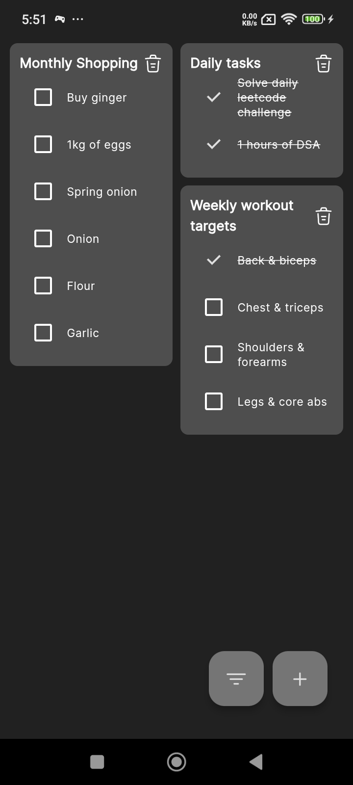
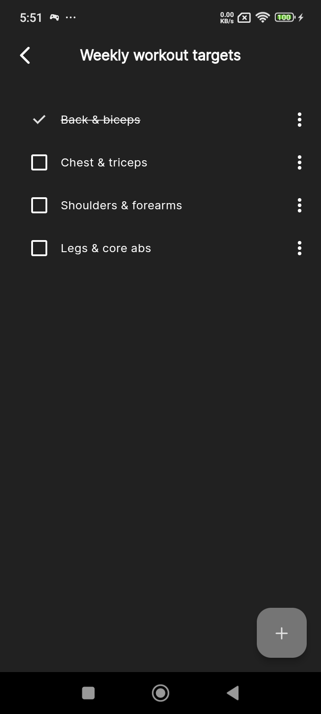
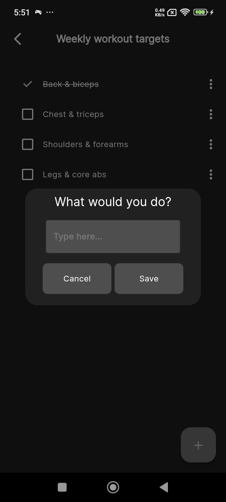

# ✅ Mobile Todo List App

Welcome to the **Mobile Todo List App**, a lightweight and efficient application for managing your tasks effectively. Built with **Flutter**, the app incorporates robust state management with **GetX** and a high-performance local database, **Isar**, making it a fast and user-friendly solution for organizing daily tasks.

## ✨ Features

- **Create Todo Lists**: Add new todo lists to organize your tasks.
- **Add Items to Todo Lists**: Manage individual tasks within a todo list.
- **Edit Tasks and Todo Lists**: Modify existing tasks and lists as needed.
- **Delete Tasks and Todo Lists**: Remove unwanted tasks or entire lists.
- **Filter Tasks**: Quickly find tasks based on specific criteria.

## 🎥 Screenshots

<div style="display: flex; flex-wrap: wrap; gap: 10px;">
  
  
  
</div>

## 🛠 Tech Stack

- **Framework**: [Flutter](https://flutter.dev/)
- **State Management**: [GetX](https://pub.dev/packages/get)
- **Database**: [Isar](https://isar.dev/)

### Why GetX for State Management?

We chose **GetX** for its simplicity and power:
- **Beginner-Friendly**: Easy to learn and implement.
- **Fast Development**: Built-in utilities minimize boilerplate code.
- **Readability**: Clean and organized code structure.
- **Reactive Programming**: Efficient state updates without performance overhead.

### Why Isar for Database?

**Isar** is a high-performance NoSQL database ideal for Flutter applications:
- **Fast**: Optimized for mobile platforms with near-native performance.
- **Lightweight**: Minimal impact on application size and speed.
- **No Dependencies**: Fully embedded with zero additional server requirements.
- **Rich Query Capabilities**: Supports complex queries and relationships.

## 🚀 Installation Guide

Follow these steps to set up and run the project locally:

### Prerequisites

- Flutter SDK ([Installation Guide](https://flutter.dev/docs/get-started/install))
- Android Studio / VSCode

### Steps

1. **Clone the Repository**
   ```bash
   git clone https://github.com/FatwahFir/todolist.git
   cd todolist
   ```

2. **Install Dependencies**
   ```bash
   flutter pub get
   ```

3. **Build and Run the Application**
   ```bash
   flutter run
   ```

4. **Build for Distribution**
   - Android: `flutter build apk`
   - iOS: `flutter build ios` (macOS required)
